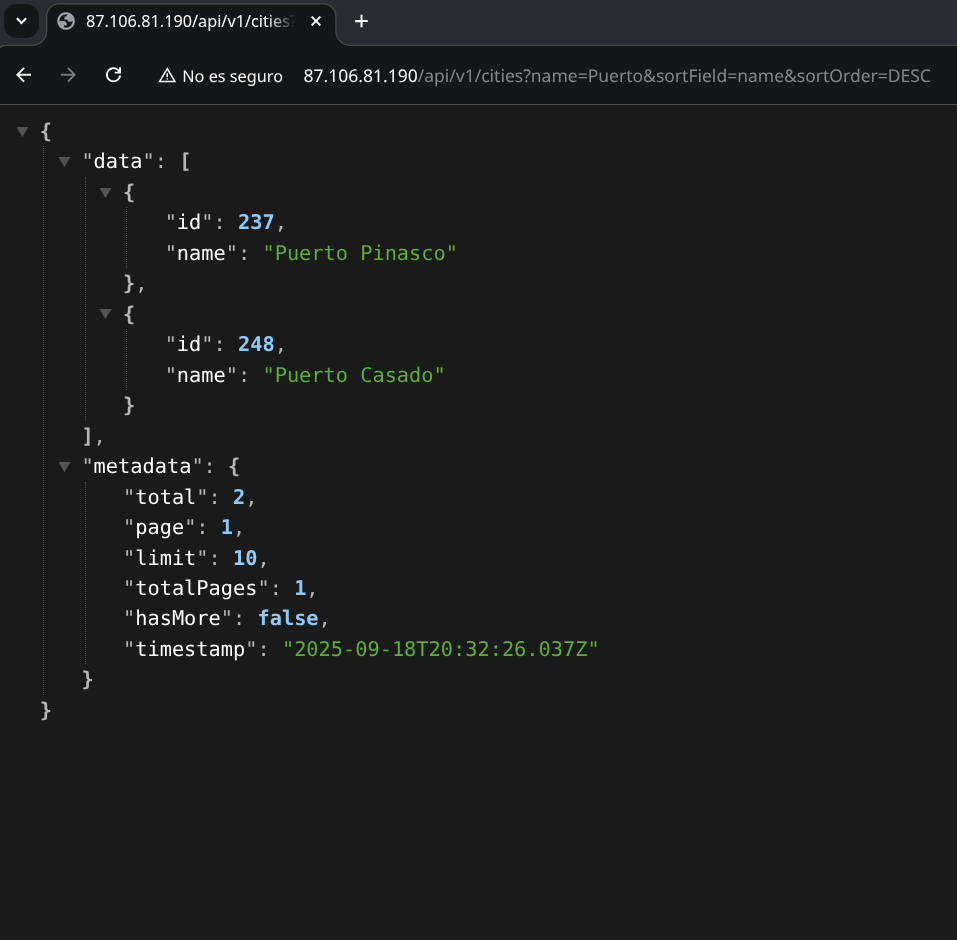
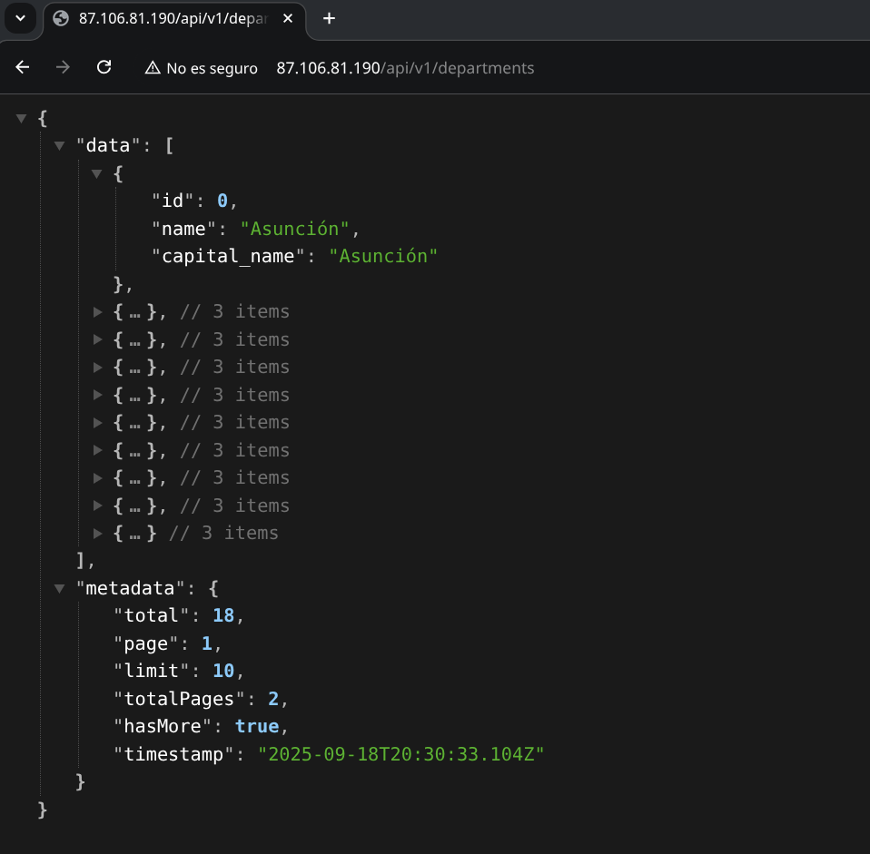
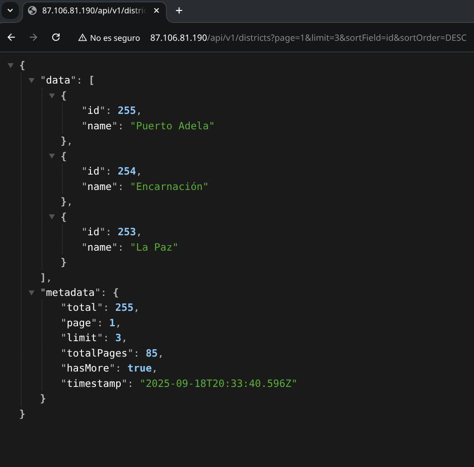
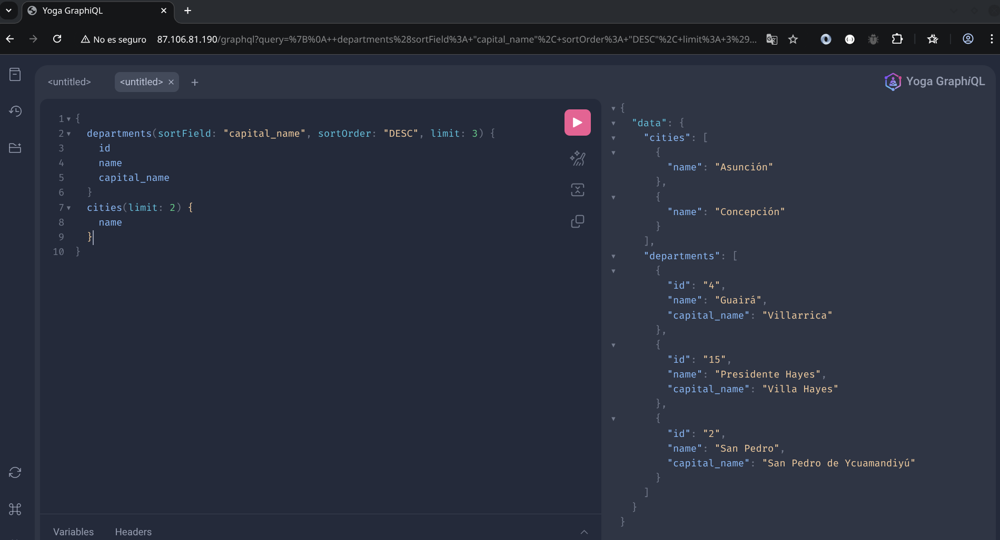
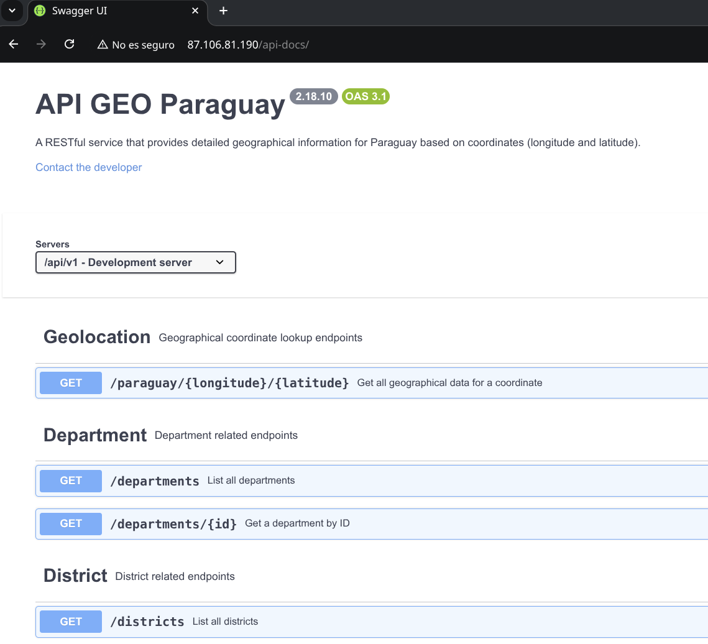

# API GEO Paraguay

**API GEO Paraguay** delivers precise geographical information for Paraguay via **REST** & **GraphQL**.

API GEO Paraguay is a powerful service that provides precise geographical information for Paraguay based on given coordinates (latitude and longitude). The API supports both traditional REST endpoints and a flexible GraphQL interface, giving you multiple options for querying geographic data including details on departments, districts, cities, and neighborhoods.

The production setup leverages both NGINX caching and Redis caching for improved performance, scalability, and rapid API responses.

  
   
  <em>A REST API query showing filtering by name and sorting results in descending order.</em>

Click to see more examples from the gallery

### Basic REST Query: All Departments

_A REST API call that returns all departments in Paraguay._

  

### REST Query: Paginated Districts

_A REST API call that returns all districts, using page=1 and limit=3 for pagination._

  

### GraphQL Query

_An example of a GraphQL query._

  

### Interactive Documentation with Swagger

_Shows the Swagger UI developers use to explore the API._

  

## Quick Links

- [Getting Started Guide](docs/guides/setup.md)
- [API Documentation](docs/api/README.md)
- [REST API](docs/guides/rest.md)
- [GraphQL API](docs/guides/graphql.md)
- [Features](docs/guides/features.md)
- [Database Architecture](docs/development/architecture.md)
- [Security & Performance](docs/guides/security.md)
- [Development Guide](docs/development/README.md)
- [API & Security Validation](docs/development/spectral.md)
  - [API Contract Validation](docs/development/spectral.md#api-contract-validation)
  - [Security Validation](docs/development/spectral.md#security-validation-with-pre-commit)
- [Support](docs/SUPPORT.md)
- [Changelog](CHANGELOG.md)

## Core Features

- REST & GraphQL APIs for geographical data
- Redis caching with GeoHash optimization
- **NGINX caching for API responses to improve performance and reduce backend load**
- Security-first design
- Production-ready with Docker support

## Contributing

See [CONTRIBUTING.md](CONTRIBUTING.md)

## License

GNU General Public License v3.0

---

© 2025 API GEO Paraguay
